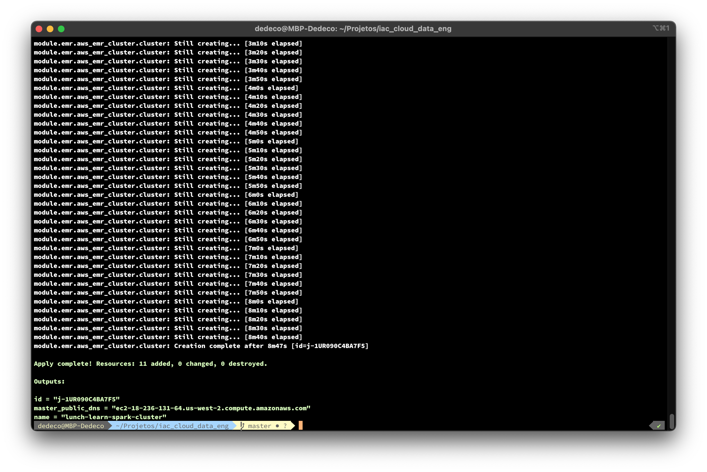
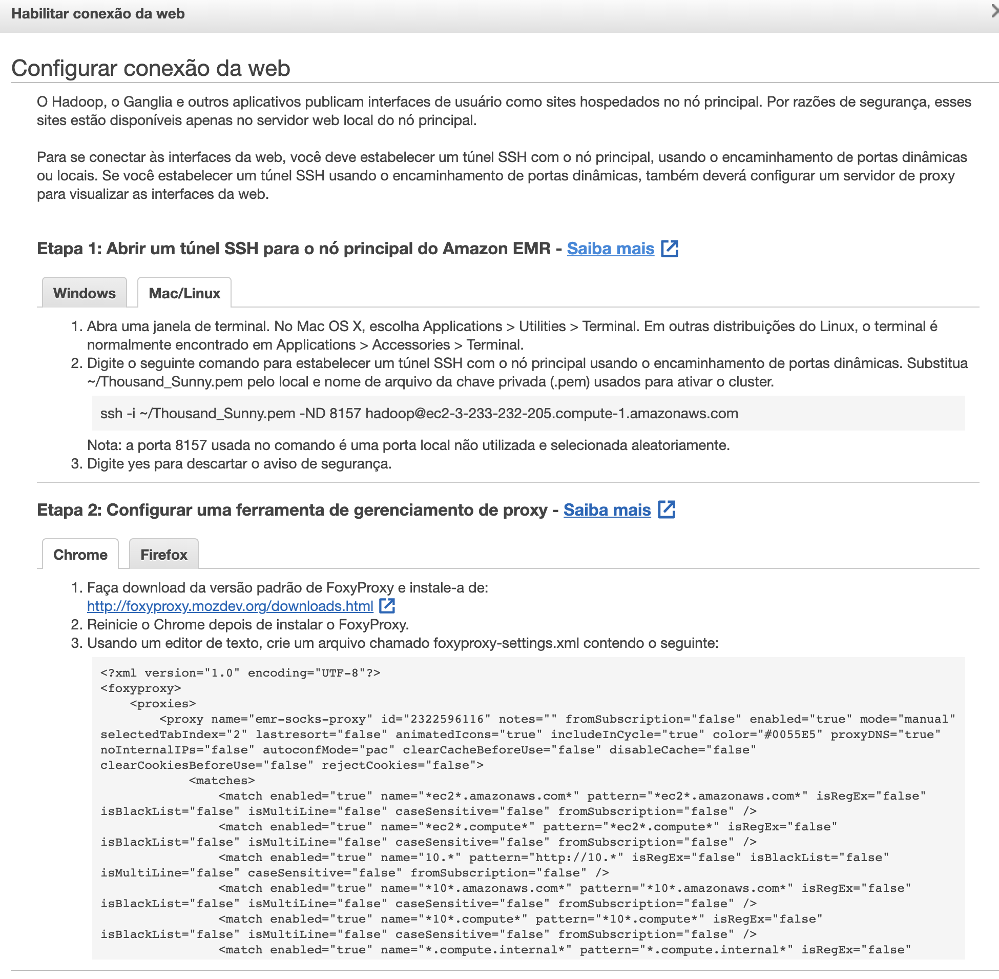
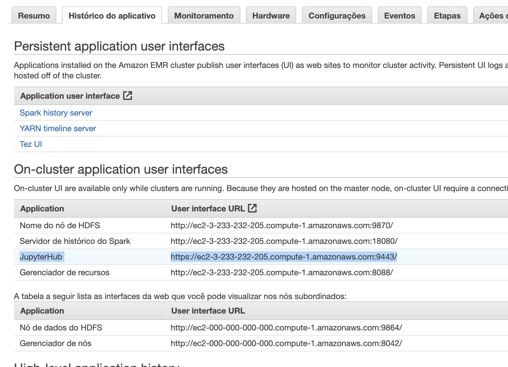

# Passo a passo
Para o passo a passo siga as etapas abaixo:


1. Clonar esse repositório:

    ```git clone git@github.com:Miyake-Diogo/iac_cloud_data_eng.git```

2. No arquivo ```terraform.tfvars``` altere os seguintes dados:

| Variável                    | Valor                                    |  Descrição                                 | 
| -------------               | -------------                            |  -------------                             |
| name                        | "lunch-learn-spark-cluster"              |   nome do cluster                          |
| region                      | "us-west-2"                              |   regiões na AWS [^2]                      |
| subnet_id                   | "subnet-ed289f95"                        |   informar sua sub-rede id [^3]:           |
| vpc_id                      | "vpc-3f6d4847"                           |   informar sua vpc id [^4]:                |
| key_name                    | "minha-chave"                            |   informar seu par de chaves [^5]:         |
| ingress_cidr_blocks         | "0.0.0.0/0"                              |                                            |
| release_label               | "emr-6.2.0"                              |                                            |
| applications                | ["Hadoop","Hive","Spark","JupyterHub"]   |                                            |
| master_instance_type        | "m5.xlarge"                              |                                            |
| master_ebs_size             | "50"                                     |                                            |
| core_instance_type          | "m5.xlarge"                              |                                            |
| core_instance_count         | 2                                        |                                            |
| core_ebs_size               | "50"                                     |                                            |

[^2]: [visualizar regiões](https://docs.aws.amazon.com/pt_br/AWSEC2/latest/UserGuide/using-regions-availability-zones.html#concepts-available-regions)
[^3]: [visualizar sua Virtual Private Cloud](https://docs.aws.amazon.com/pt_br/vpc/latest/userguide/default-vpc.html#view-default-vpc)
[^4]: [visualizar sub rede](https://docs.aws.amazon.com/pt_br/vpc/latest/userguide/working-with-vpcs.html#view-subnet)
[^5]: [visualizar par de chaves](https://docs.aws.amazon.com/emr/latest/ManagementGuide/emr-plan-access-ssh.html)

3. No arquivo ```main.tf``` altere o arquivo conforme abaixo:

| Variável                    | Valor                                    |  Descrição                                 | 
| -------------               | -------------                            |  -------------                             |
| shared_credentials_file     | "~/.aws/credentials"                     |   local das credenciais [^6]:              |


[^6]: Para unix=~/.aws/credentials, para windows=%USERPROFILE%\.aws\credentials 


3. Inicialize o diretório:

```terraform init```

Ao criar uma nova configuração - ou verificar uma configuração existente no controle de versão - você precisa inicializar o diretório com terraform init.

O Terraform usa uma arquitetura baseada em plug-in para oferecer suporte a centenas de provedores de infraestrutura e serviços. A inicialização de um diretório de configuração baixa e instala provedores usados ​​na configuração, que neste caso é o provedor aws. Os comandos subsequentes usarão configurações e dados locais durante a inicialização.

Rode no terminal:

4. Deploy cria sua infra-estrutura:

    ```terraform apply```

    > Irá aparecer a pergunta: Do you want to perform these actions?
    > Digite: yes

5. Pronto, seu cluster está pronto para ser usado. 



[Vá no console](https://us-west-2.console.aws.amazon.com/elasticmapreduce/home?region=us-west-2#) e veja que ele está sendo provisionado. Aguarde aproximadamente ~9 minutos (8m40s) para ter seu cluster criado.


6. Após subir o cluster é necessário configurar o acesso de tunel ssh para conectar ao ambiente web.  
Siga as etapas clicando em habilitar conexão web.  
Obs.: Usei o Firefox pela facilidade.  




Após isso basta clicar na aba histórico do aplicativo e selecione o seu endereço do jupyter ub no ec2.  


Copie e cole no seu navegador.  
Ao abrir a aba coloque a o user:`jovyan` e a senha: `jupyter`.  
[referência](https://docs.aws.amazon.com/emr/latest/ReleaseGuide/emr-jupyterhub-user-access.html)


7. Para destruir toda infra-estrutura basta rodar o commando:

```terraform destroy```

