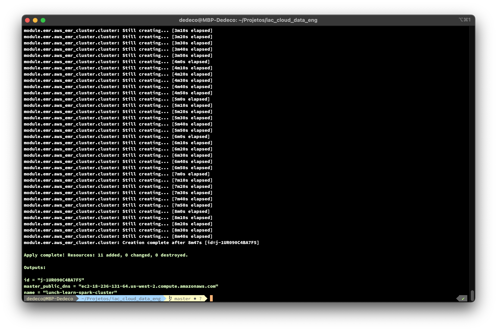

# Objetivo

Seguindo as instruções desse repositório você poderá subir um cluster [EMR](https://aws.amazon.com/pt/emr/?whats-new-cards.sort-by=item.additionalFields.postDateTime&whats-new-cards.sort-order=desc) na sua nuvem AWS.  O Amazon EMR é a plataforma de big data em nuvem líder do setor para processar grandes quantidades de dados usando ferramentas de código aberto, como Apache Spark, Apache Hive, Apache HBase, Apache Flink, Apache Hudi e Presto. 

**Vamos usar terraform para seja possível todos subirem a mesma plataforma com a mesma configuração, e depois destruir a infraestrutura.**

## Terraform
O Terraform é uma ferramenta open source para gerenciamento e provisionamento da infraestrutura como código (IaC). Desenvolvida e mantido pela HashiCorp, a ferramenta utiliza uma linguagem simples e declarativa, permitindo desta forma o provisionamento desde uma simples VM até uma infra completa, passando por recursos de rede, segurança, banco de dados, balanceadores de carga e outros.

Nas palavras da própria HashiCorp:

>O Terraform[^1] é usado para criar, gerenciar e atualizar recursos de infraestrutura, como máquinas físicas, VMs, comutadores de rede, contêineres e muito mais. Quase qualquer tipo de infraestrutura pode ser representado como um recurso no Terraform. 

[^1]: Site oficial da ferramenta: https://www.terraform.io. [Aqui](https://learn.hashicorp.com/tutorials/terraform/aws-build?in=terraform/aws-get-started) você poder ver alguns vídeos sobre como começar na AWS com Terraform:

## Pré requisitos
- Ter uma conta na AWS. Se não tiver [crie uma conta](https://docs.aws.amazon.com/pt_br/polly/latest/dg/setting-up.html#setting-up-signup).
- Criar um usuário seu [access key ID e a chave de acesso secreta](https://docs.aws.amazon.com/pt_br/powershell/latest/userguide/pstools-appendix-sign-up.html) com acesso AdministratorAccess. Salve sua chave em lugar seguro.
- Instalar terraform:
    ```brew install terraform```
    Verificar a instalação
    ```terraform version```
    Resultado esperado: Terraform v0.14.8 (ou versão mais recente)

- Suas credenciais AWS configuradas localmente.

    Com sua conta criada e o CLI instalado, configure o AWS CLI:
    ```aws configure```
    
    Siga os prompts para inserir sua AWS Access Key ID e Secret Access Key, que você encontrará [nesta página](https://console.aws.amazon.com/iam/home?#security_credential).
    
    O processo de configuração cria um arquivo em ```~/.aws/credentials``` no MacOS e Linux ```%UserProfile%\.Aws\credentials``` no Windows, onde suas credenciais são armazenadas.


## Passo a passo

1. Clonar esse repositório:

    ```git clone git@github.com:Miyake-Diogo/iac_cloud_data_eng.git```

2. No arquivo ```variables.tf`` altere os seguintes dados:

| Variável                    | Valor                                    |  Descrição                                 | 
| -------------               | -------------                            |  -------------                             |
| name                        | "lunch-learn-spark-cluster"              |   nome do cluster                          |
| region                      | "us-west-2"                              |   regiões na AWS [^2]                      |
| subnet_id                   | "subnet-ed289f95"                        |   informar sua sub-rede id [^3]:           |
| vpc_id                      | "vpc-3f6d4847"                           |   informar sua vpc id [^4]:                |
| ingress_cidr_blocks         | "0.0.0.0/0"                              |                                            |
| release_label               | "emr-6.2.0"                              |                                            |
| applications                | ["Hadoop","Hive","Spark","JupyterHub"]   |                                            |
| master_instance_type        | "m5.xlarge"                              |                                            |
| master_ebs_size             | "50"                                     |                                            |
| core_instance_type          | "m5.xlarge"                              |                                            |
| core_instance_count         | 2                                        |                                            |
| core_ebs_size               | "50"                                     |                                            |

[^2]: [visualizar regiões](https://docs.aws.amazon.com/pt_br/AWSEC2/latest/UserGuide/using-regions-availability-zones.html#concepts-available-regions)
[^3]: [visualizar sua Virtual Private Cloud](https://docs.aws.amazon.com/pt_br/vpc/latest/userguide/default-vpc.html#view-default-vpc)
[^4]: [visualizar sub rede](https://docs.aws.amazon.com/pt_br/vpc/latest/userguide/working-with-vpcs.html#view-subnet)


3. No arquivo ```main.tf``` altere o arquivo conforme abaixo:

| Variável                    | Valor                                    |  Descrição                                 | 
| -------------               | -------------                            |  -------------                             |
| shared_credentials_file     | "~/.aws/credentials"                     |   local das credenciais [^5]:              |


[^5]: Para unix=~/.aws/credentials, para windows=%USERPROFILE%\.aws\credentials 


3. Inicialize o diretório:

```terraform init```

Ao criar uma nova configuração - ou verificar uma configuração existente no controle de versão - você precisa inicializar o diretório com terraform init.

O Terraform usa uma arquitetura baseada em plug-in para oferecer suporte a centenas de provedores de infraestrutura e serviços. A inicialização de um diretório de configuração baixa e instala provedores usados ​​na configuração, que neste caso é o provedor aws. Os comandos subsequentes usarão configurações e dados locais durante a inicialização.

Rode no terminal:


4. Deploy cria sua infra-estrutura:

    ```terraform apply```

    > Irá aparecer a pergunta: Do you want to perform these actions?
    > Digite: yes

5. Pronto, seu cluster está pronto para ser usado. 



[Vá no console](https://us-west-2.console.aws.amazon.com/elasticmapreduce/home?region=us-west-2#) e veja que ele está sendo provisionado. Aguarde aproximadamente ~9 minutos (8m40s) para ter seu cluster criado.


6. Para destruir toda infra-estrutura basta rodar o commando:

```terraform destroy```

